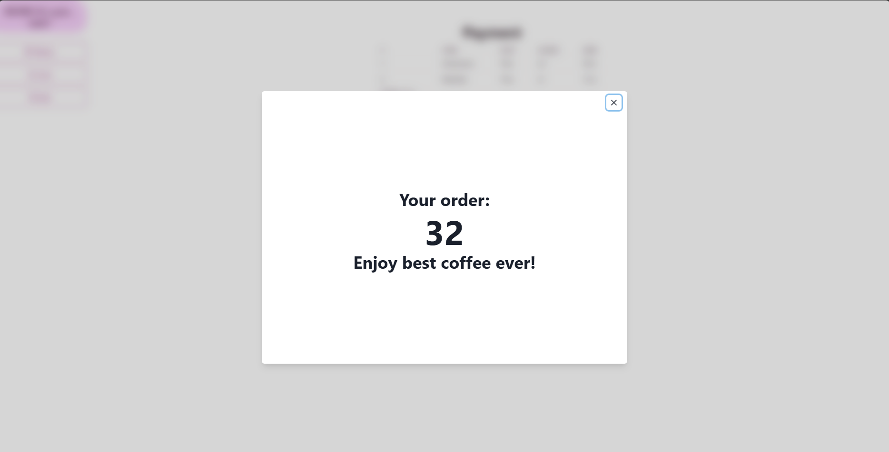

# Cafeteria manangment system - Frontend part

Backend for the project is here: https://github.com/piratinskii/SCECafe-backend

## Project Description

This is my college project and my first ever fullstack RESTFul application. I wrote it using JAVA and Spring for the backend and React for the frontend. As database I used PostgreSQL.

In this project you can:
- Add/remove/change items into your menu as admin
- Order the items as user
- Mark items and orders as done as barista.

## Installation 

1. Clone the repository (use these commands in the terminal):    
   ```git clone https://github.com/piratinskii/SCECafe-frontend.git```
   
   ```cd SCECafe-frontend``` 

2. Make sure, that you succesfully installed and ran backend part
3. Install the frontend:
   ```npm install```

## Usage 

Run the server: 

```npm start```

Page will be opened automaticly.

## Screenshots
#### Admin:
Adding and editing items:


#### User:
Login page:


Menu:


Cart page:


Summary/confirmation page:


Card details page:


Success page:


#### Barista:
Orders page:


